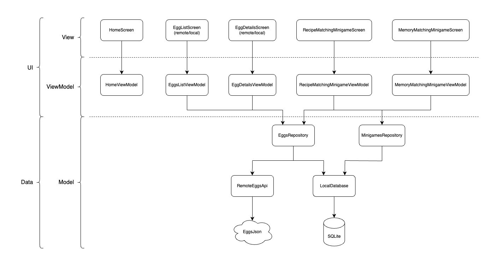

# Eggpedia

A Kotlin Multiplatform Android and iOS mobile app to explore recipes and play minigames about eggs.

## Table of contents

- [Demo](#demo)
- [Motivation](#motivation)
- [Built with](#built-with)
- [My experience building with Kotlin Multiplatform](#my-experience-building-with-kotlin-multiplatform)
- [Features](#features)
- [Architecture](#architecture)
- [Modules](#modules)
- [How to run project](#how-to-run-project)
- [Eggs JSON endpoint](#eggs-json-endpoint)
- [License](#license)

## Demo

<video controls>
  <source src="readme/eggpedia.mp4" type="video/mp4">
  Your browser does not support the video tag.
</video>

## Motivation

As someone who likes to eat eggs and wanted to build a Kotlin Multiplatform (KMP) project from scratch, I envisioned an Android and iOS app about eggs using KMP to combine my unique interests.

## Built with

- [Kotlin](https://kotlinlang.org/)
- [Gradle](https://gradle.org/)
- [Kotlin Multiplatform](https://www.jetbrains.com/kotlin-multiplatform/)
- [Compose Multiplatform](https://www.jetbrains.com/compose-multiplatform/)
- [Room](https://developer.android.com/kotlin/multiplatform/room)
- [SQLite](https://developer.android.com/kotlin/multiplatform/sqlite#sqlite-driver-implementations)
- [Ktor](https://ktor.io/)
- [Koin](https://insert-koin.io/)
- [Coil](https://coil-kt.github.io/coil/)
- [Konnectivity](https://github.com/mirego/konnectivity)

## My experience building with Kotlin Multiplatform

Building with KMP has been an amazing learning experience. As an Android developer, I was able to transfer a lot of my knowledge to build a KMP app that targeted both Android and iOS. As KMP allowed for writing the business logic once and having it shared across Android and iOS, being able to also implement the UI in Kotlin for both platforms with Compose Multiplatform (CMP) was also amazing. KMP and CMP allowed for sharing business logic and UI code across Android and iOS, which significantly reduced the amount of effort needed to build 2 apps while being able to unify business logic. Here are some of my key points from my experience:

- Code sharing
  - The ability to write common business logic once without the need to restrict UI code in Kotlin and share it across platforms is game-changing
- Developer experience
  - While there was a learning curve, the Kotlin community, available resources, and tools made the learning process both smooth and enriching
- Performance
  - The performance of the shared code felt on par with platform-specific implementations made possible by the Kotlin interoperability with Swift/Objective-C

In summary, KMP has proven to be a powerful technology for building cross-platform applications. Whether you want to isolate business logic in a single KMP module while keeping native UI or fully write Kotlin for business logic and UI, I'm thrilled and convinced about KMP and look forward to leveraging it in my future work and projects.

## Features

- Home screen
  - Displays a greeting message and buttons for navigating to the egg list screens or minigames screen
- Eggs list screen
  - Displays egg list items from remote/local source with a search bar to filter for egg recipes by their name
- Egg details screen
  - Displays egg details from remote/local source with a button to save or remove the recipe from cache
- Minigames
  - Recipe matching minigame
    - A timed minigame where the player needs to select the associated image with the recipe name
  - Memory matching minigame
    - A time minigame where the player needs to memorize and match pairs of hidden egg images

## Architecture

The architecture mirrors the recommended architectural principles and best practices for building clean, scalable, and maintainable apps for Android. The app closely follows the Model-View-ViewModel design pattern adhering to techniques such as reactive and layered architecture, Unidirectional Data Flow (UDF), asynchronicity using coroutines and flows, state holders for UI, and dependency injection. The diagram below illustrates the app's architecture following MVVM and clean architecture.



## Modules

- `composeApp`
  - A Kotlin module that contains the logic shared among the Android and iOS apps
- `iosApp`
  - An Xcode project that builds into an iOS application that depends on and uses the shared module as an iOS framework

## How to run project

These steps assume that your environment is set up for both Android and iOS development.

Targets

- Android
  - Open the project in Android studio and go through the run configurations
- iOS
  - Open the project in Xcode and go through the run configurations

## Eggs JSON endpoint

The eggs JSON endpoint serves as the remote data source. The data could be found [here](https://jaidensiu.vercel.app/eggs.json).

# License

```
MIT License

Copyright (c) 2025 Jaiden Siu

Permission is hereby granted, free of charge, to any person obtaining a copy
of this software and associated documentation files (the "Software"), to deal
in the Software without restriction, including without limitation the rights
to use, copy, modify, merge, publish, distribute, sublicense, and/or sell
copies of the Software, and to permit persons to whom the Software is
furnished to do so, subject to the following conditions:

The above copyright notice and this permission notice shall be included in all
copies or substantial portions of the Software.

THE SOFTWARE IS PROVIDED "AS IS", WITHOUT WARRANTY OF ANY KIND, EXPRESS OR
IMPLIED, INCLUDING BUT NOT LIMITED TO THE WARRANTIES OF MERCHANTABILITY,
FITNESS FOR A PARTICULAR PURPOSE AND NONINFRINGEMENT. IN NO EVENT SHALL THE
AUTHORS OR COPYRIGHT HOLDERS BE LIABLE FOR ANY CLAIM, DAMAGES OR OTHER
LIABILITY, WHETHER IN AN ACTION OF CONTRACT, TORT OR OTHERWISE, ARISING FROM,
OUT OF OR IN CONNECTION WITH THE SOFTWARE OR THE USE OR OTHER DEALINGS IN THE
SOFTWARE.
```
